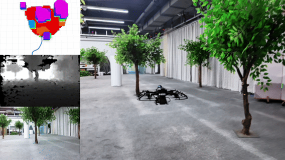

# Diff-Planner VLA Integration Fork

This repository is a ROS 1 local-planning stack for autonomous UAV navigation.
It is based on Diff-Planner and EGO-Planner-v2, with an incremental integration
package that connects remote OpenVLA/π0.5 semantic decisions to onboard
localization, obstacle avoidance, and trajectory generation.

The fork uses a hierarchical control architecture: the remote VLA policy
proposes short, bounded local goals at a low rate, while FAST-LIO/EKF and
Diff-Planner continue mapping, state estimation, collision checking, and
trajectory optimization onboard at a higher rate. VLA output is never treated
as a motor, attitude, or raw actuator command.

<p align="center">
  
</p>

## Main capabilities

- single-UAV and multi-UAV local trajectory planning;
- lidar and visual-localization launch configurations;
- A* and optimization robustness improvements inherited from Diff-Planner;
- waypoint and return-path support through the `user_command` packages;
- yaw-aware trajectory-server output; and
- a safety-gated VLA bridge for observation upload, command validation, preview,
  and optional planner-goal publication.

## VLA integration package

`src/integration/vla_diff_bridge` is an independent catkin package. It provides:

- `onboard_observation_uplink_node.py` — uploads synchronized RGB images,
  CameraInfo, odometry, transforms, and optional planner-preview feedback without
  blocking the camera callback;
- `vla_diff_bridge_node.py` — receives TCP/NDJSON commands and validates source,
  token, schema, sequence, TTL, calibration, coordinate frames, odometry age,
  and goal limits;
- preview-only ROS topics that remain isolated from the flight-control chain;
- optional live publication to `/goal` and `/planning/yaw` behind explicit,
  independent safety gates; and
- launch files and wrappers for FAST-LIO/EKF integration.

Checked-in network settings use loopback or `REQUIRED` placeholders. Deployment
addresses, authentication tokens, camera serial numbers, and calibration IDs
must be supplied through a private environment file and must never be committed.

## Safety defaults

The VLA integration fails closed:

- `live_publish_enabled` defaults to `false`;
- `preview_only_mode` defaults to `true`;
- authentication and calibration values default to `REQUIRED`;
- live startup requires explicit host and onboard confirmation gates;
- stale, future-dated, out-of-order, oversized, non-finite, or out-of-bounds
  commands are rejected; and
- the VLA preview wrappers do not arm PX4, switch its flight mode, or issue an
  automatic takeoff command.

Some original Diff-Planner scripts are intended for real flight and can start
PX4Ctrl or publish mission goals. Read every launcher before use, keep the
vehicle disarmed during integration checks, and follow a separate supervised
flight procedure.

## Requirements

- Ubuntu 20.04 with ROS Noetic for the validated ROS 1 deployment path;
- catkin and the dependencies declared by the included packages;
- a compatible FAST-LIO/EKF odometry source and registered point cloud for the
  lidar configuration; and
- camera topics and a validated `body <- camera` TF for VLA observation upload.

The upstream planner also supports older ROS 1/Ubuntu combinations, but the VLA
integration should be revalidated before using a different platform.

## Build

```bash
git clone --recursive <repository-url>
cd Diff-Planner
catkin_make
source devel/setup.bash
```

The integration package is built incrementally with the rest of this catkin
workspace; no replacement of the core planner package is required.

## Planner simulation

Start the single-UAV RViz simulation:

```bash
source devel/setup.bash
roslaunch diff_planner run_sim_single.launch
```

Use RViz **3D Nav Goal** to provide a target. For the upstream preset-waypoint
workflow, configure `src/user_command/multipoint/config/points.yaml`, then run
the relevant `multipoint` launch or trigger script.

## Safe VLA preview

Create a private onboard environment file outside the repository, for example
`~/.config/vla_stack.env`, containing at least:

```bash
export VLA_BACKEND_URL=http://<HOST_ONBOARD_IP>:8080
export VLA_HOST_IP=<HOST_ONBOARD_IP>
export VLA_BRIDGE_TOKEN=<RANDOM_BRIDGE_TOKEN>
export VLA_OBSERVATION_TOKEN=<RANDOM_OBSERVATION_TOKEN>
export VLA_CALIBRATION_ID=<VALIDATED_CALIBRATION_ID>
export VLA_CALIBRATION_VALIDATED=I_VALIDATED_CAMERA_INFO_AND_TF
export VLA_BRIDGE_MODE=preview
```

Before starting the full preview wrapper, provide ROS master, MAVROS telemetry,
FAST-LIO/EKF odometry, registered point cloud, and camera topics. The wrapper
checks that MAVROS is connected and the vehicle is disarmed. It does not arm the
vehicle:

```bash
./sh_files/start_onboard_vla_full_preview.sh
```

For a planner-only isolated preview, review and invoke
`src/integration/vla_diff_bridge/scripts/run_vla_fastlio_diff_preview.sh` with
the same private environment values. Never use placeholder values on a real
network.

## Coordinate and command contract

The integration uses these default semantics:

- world frame: right-handed, Z-up local frame shared by EKF and Diff-Planner;
- body frame: ROS FLU (`x` forward, `y` left, `z` up);
- optical frame: ROS camera convention (`x` right, `y` down, `z` forward);
- VLA action: `[dx_body, dy_body, dz_body, d_yaw]` in metres and radians; and
- planner target: a bounded absolute position in the configured world frame.

The host performs the initial body-to-world conversion. The onboard bridge then
checks frame names, calibration identity, observation freshness, odometry
freshness, target step, altitude bounds, sequence, and command lifetime before
publishing a preview or live target.

## Documentation

- `docs/VLA_BRIDGE_MODIFICATIONS.md` — fork-level integration changes.
- `src/integration/vla_diff_bridge/docs/01_ARCHITECTURE.md` — package architecture.
- `src/integration/vla_diff_bridge/docs/02_PROTOCOL.md` — wire protocol.
- `src/integration/vla_diff_bridge/docs/03_LAUNCH_AND_CONFIG.md` — parameters and launch usage.
- `src/integration/vla_diff_bridge/docs/04_SAFETY_AND_TESTING.md` — safety and validation strategy.
- `src/integration/vla_diff_bridge/docs/10_ONBOARD_DEPLOYMENT.md` — sanitized deployment record.

## Upstream projects and acknowledgements

This fork retains the work of the Diff-Planner maintainers and is derived from
[EGO-Planner-v2](https://github.com/ZJU-FAST-Lab/EGO-Planner-v2) by ZJU FAST Lab.
Please preserve all upstream copyright and attribution notices.

## License

This repository is distributed under the GNU General Public License v3.0. See
`LICENSE` for the complete terms. External dependencies, model weights, datasets,
and simulator assets remain subject to their own licenses.
